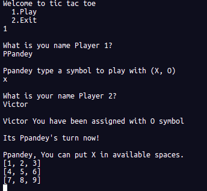
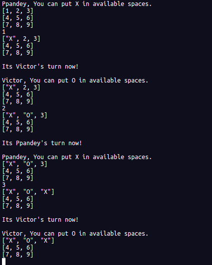
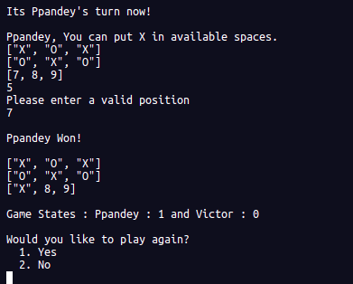

# Ruby-OOP-Project-Game

In this project, we're required to create a Tic Tac Toe Game using Ruby with OOP concepts.

> This project is split into 4 milestones, which were:


- Setting up the project
- Designing the user interface
- Creating the game logic
- Writing the game instructions


> The main goal of this project is to ensure the mastery of the methods ruby provides and to learn how to replicate them using basic coding knowledge.

## How to play:

### Tic Tac Toe game rules:


>  

- The game starts with an empty board
- Player 1 start by one case using X or O and Player 2 continue by filling the next case using the remaining symbol.
- The game continues until we have a winning combination (check images below) or the grid is full and it is a draw.
  
- Winning combinations are full row, full column or full diagonal.

### Play the game:

- Use the live version on the repl.it platform above or you can clone the repository into your local environment and CD to the bin folder.
- Run this command:

```
$ ./bin/main.rb
```

- You have two options: 1 - start new game or 2 - quit the game.
- It ask names of players and later use to communicate.
- The game starts with an empty board with array positions and a score of player 1: 0 and player 2: 0
> 
- The game shows the board status, whose player turn is and the possible moves. The player should choose the available positions presented in a 2D array
- The game continues until we get a winning combination or a draw.
> 
- If a player wins, the score increase and the game will display 2 options: Continue or Quit.
> 


## Live Demo

You can play the game on repl.it platform, skip environment set up section and follow how to play section

 [](https://repl.it/github/Prabhakarzx/Ruby-OOP-Project-Game)


## Environment set up requirements

To run this game, you need ruby installed in your environment.
Run the following command:

```
$ ruby -v
```

You should have a result similar to this:

```
ruby 2.6.5p114 (2019-10-01 revision 67812) [x86_64-linux]
```

If you don't get that result, follow this [link](https://www.ruby-lang.org/en/documentation/installation/) and install Ruby in your local environment.


## Authors

👤 **Victor Manuel Gonzalez Buitrago**

- Github: [@Shaqri](https://github.com/Shaqri)
- Twitter: [@victorgonbu](https://twitter.com/victorgonbu)
- Linkedin: [linkedin](https://www.linkedin.com/in/victor-manuel-gonzalez-buitrago-8704731a5/)

👤 **PRABHAKAR PANDEY**

- Github: [@Prabhakarzx](https://github.com/Prabhakarzx)
- Twitter: [@Prabhakarzx](https://twitter.com/prabhakarzx)
- Linkedin: [@Prabhakarzx](https://www.linkedin.com/in/prabhakarzx/)

[](https://repl.it/github/Prabhakarzx/Ruby-OOP-Project-Game)
Milestone 3: Game Logic (In progreess)

- Put the game logic in work
- Validate user moves 
- check moves against winning and draw moves


## 🤝 Contributing

Contributions, issues and feature requests are welcome!

Feel free to check the [issues page](https://github.com/Prabhakarzx/Ruby-OOP-Project-Game/issues).

## Show your support

Give a ⭐️ if you like this project!

## Acknowledgments

- [Microverse](https://github.com/microverseinc)
- TheOdinProject
- Github
- ruby-lang.org
- repl.it
- depositphotos.com
- And anyone who supported us!

## 📝 License

This project is [MIT](LICENSE) licensed.
